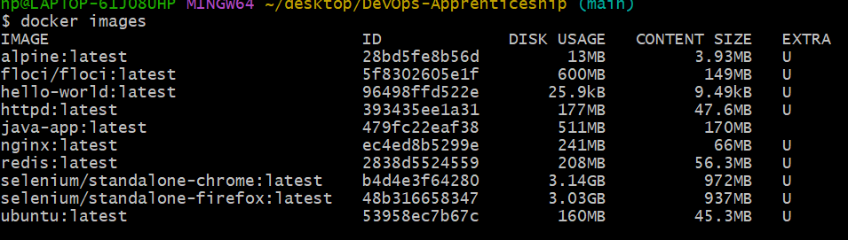
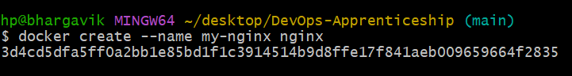
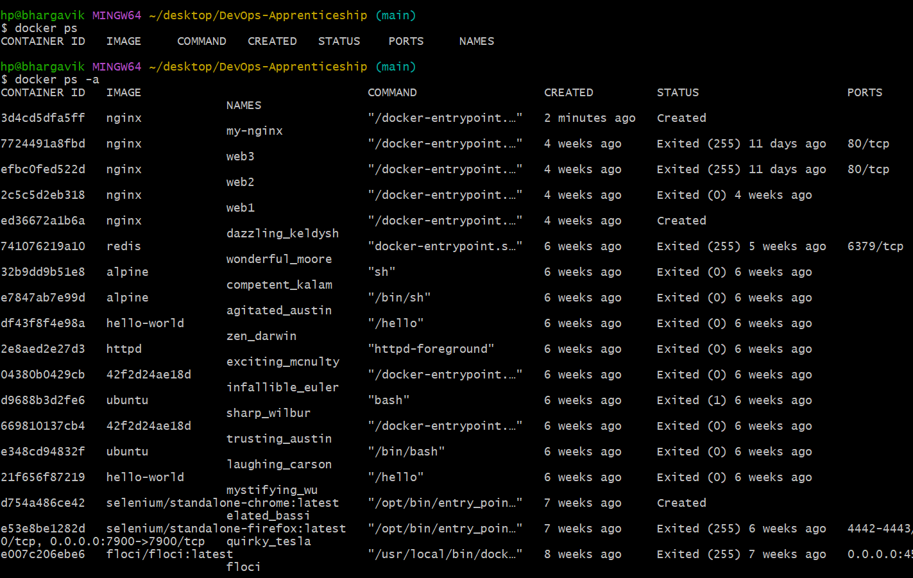
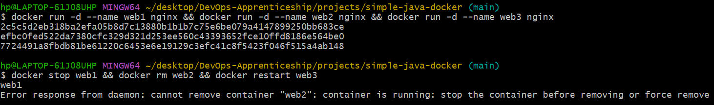

# Day 2 – Challenge Lab: Docker Container Lifecycle (Session 4 & 5)

**Date:** 31 July 2026  
**Objective:**  
By the end of this lab, you should understand the complete lifecycle of a container and the difference between an image and a container.

---

## Session 4 – Understanding the Docker Container Lifecycle

### Part 1 – Check Existing Images

**Command:**

```bash
docker images
```

**Purpose:**  
Shows the local Docker image inventory and their size usage. It helps you see which images are installed, how much disk they occupy, and whether they are currently unused.

**Observation:**

- There are **10 images** present.  
- Repositories listed:  
  - `alpine`  
  - `floci/floci`  
  - `hello-world`  
  - `httpd`  
  - `java-app`  
  - `nginx`  
  - `redis`  
  - `selenium/standalone-chrome`  
  - `selenium/standalone-firefox`  
  - `ubuntu`  
- All tags are `latest`.  
- The largest image is `selenium/standalone-chrome:latest`.

---

### Part 2 – Create a Container Without Running It

**Commands:**

```bash
docker create --name my-nginx nginx
docker ps
docker ps -a
```


**Observation:**

- `docker ps` shows nothing.  
- `docker ps -a` shows the container with status `Created`.  
- The container exists but isn’t running.

**Reflection – Why is the container created but not running?**

`docker create` only prepares the container (status = `Created`); it does not start the main process. That’s why after `docker create --name my-nginx nginx`, the container exists but is not running until I call `docker start my-nginx`.

---

### Part 3 – Start the Container

**Commands:**

```bash
docker start my-nginx
docker ps
```


**Observation:**

- The status changes from `Created` to `Up`.  
- The container is now running.

**Reflection – What changed between `docker create` and `docker start`?**

`docker create` only creates the container without starting it; it needs the `docker start` command to actually start the container’s main process.

---

### Part 4 – Stop the Container

**Commands:**

```bash
docker stop my-nginx
docker ps
docker ps -a
```

**Observation:**

- `docker ps` shows nothing (no running containers).  
- `docker ps -a` still shows the container, now in `Exited` state.

**Reflection – Stopping is different from deleting. Explain why.**

`docker stop` just halts the running process and moves the container to the “exited” state, while `docker rm` actually deletes the container object and its writable layer. That’s why a stopped container still appears in `docker ps -a` but a removed one does not.

---

### Part 5 – Restart the Container

**Commands:**

```bash
docker restart my-nginx
docker ps
```

**Observation:**

- The container is running again.

**Question – Why didn’t Docker create a new container?**

`docker restart` stops and then starts an **existing** container; it doesn’t take an image, it takes a container name/ID. So Docker reuses the same container with the same ID, layers, and configuration instead of creating a new one.

---

### Part 6 – Remove the Container

**Commands:**

```bash
docker stop my-nginx
docker rm my-nginx
docker ps -a
```

**Observation:**

- After `docker rm my-nginx`, the container no longer appears in `docker ps -a`.  
- The container is gone.

---

### Part 7 – Check the Image

**Command:**

```bash
docker images
```

**Observation:**

- The `nginx` image is still present.

**Reflection – Why wasn’t the image deleted?**

`docker rm` removes only the container, not the image. Images and containers are separate objects, so deleting a container leaves the base image intact for reuse.

---

### Part 8 – Remove the Image

**Command:**

```bash
docker rmi nginx
```

**Observation:**

- If Docker refuses, it shows an error like:  
  `image is being used by stopped/running container`.

**Question – Why can’t Docker remove an image that is still being used?**

Docker won’t remove an image that’s still used by a container because the container’s filesystem depends on that image’s layers; deleting the image would break the container. So Docker requires you to remove the dependent containers first.

---

### Part 9 – Run Nginx Again

**Command:**

```bash
docker run nginx
```

**Questions:**

- **Did Docker download nginx again?**  
  No, it used the local image.

- **Why or why not?**  
  Docker only downloads when the image is not stored locally. Since `nginx:latest` was already cached, Docker reused the local image.

---

## Session 5 – Break‑It Challenge

**Task:**  
Create three `nginx` containers. Stop one. Delete one. Restart another.



**Question – Which commands failed? Why?**

In this lab, the command that fails is `docker rm` on a **running** container. Docker doesn’t let you remove a running container (error: `You cannot remove a running container`) because that would kill an active workload and potentially corrupt state. You have to stop it first (`docker stop`) or use `docker rm -f` to force removal. `docker stop` and `docker restart` succeed because they are designed to manage the lifecycle of existing containers without deleting them.

---

## Production Scenario – “My container disappeared”

**Scenario:**  
A developer says, “My container disappeared.”

**Investigation steps:**

```bash
docker ps
docker ps -a
```

**Questions:**

- Did it stop?  
- Did someone delete it?  
- Was the image removed?  
- How do you check?

**Answers:**

- I used `docker ps -a`; it shows running and stopped containers.  
- If the container does **not** appear in `docker ps -a`, it has been removed or pruned.

**Interpretation:**

- Present in `docker ps -a` but not in `docker ps` → container exists, just stopped.  
- Not present even in `docker ps -a` → it was removed or never existed.

**Check for prune or forced removal:**

```bash
docker container prune
docker system prune -a
docker rm -f <container-id>
```

---

