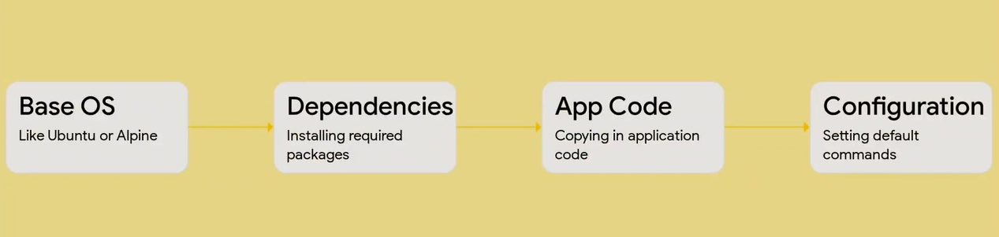

# Session 1 – Understanding Docker Architecture

## Mission

Understand Docker's architecture.

## What Happens Internally When You Run a Docker Command?

Example:

```bash
docker run -d -p 80:80 nginx
```

### 1. Docker Client Receives the Command

When you execute the command in the terminal, the Docker CLI receives it.

The Docker Client is the interface that accepts Docker commands such as:

```bash
docker run
docker ps
```

Its job is not to create containers. It sends requests to the Docker Daemon.

---

### 2. Docker Client Sends a REST API Request

The Docker Client converts the command into a Docker REST API request.

On Linux, this request is usually sent through the Unix socket:

```text
/var/run/docker.sock
```

### Communication Flow

```text
Terminal
   ↓
Docker Client
   ↓
REST API
   ↓
/var/run/docker.sock
   ↓
Docker Daemon
```

### Why Does Docker Use a Unix Socket on Linux?

Linux provides a Unix Domain Socket, which allows two processes on the same machine to communicate efficiently.

When the Docker Client and Docker Daemon are running on the same Linux system, using a Unix socket:

* Is faster than sending network traffic
* Is more secure because Linux file permissions protect the socket
* Requires no network configuration

---

### 3. Docker Daemon Receives the Request

The Docker Daemon (`dockerd`) is the background service responsible for executing Docker operations.

When it receives the request, it starts processing it.

---

### 4. Docker Checks for the Image

The daemon checks whether the required image exists locally.

For example:

```bash
docker run nginx
```

Docker checks whether the `nginx` image is available locally.

* If the image exists locally → Docker uses the local image.
* If the image does not exist locally → Docker contacts Docker Hub, downloads the image, and stores it locally.

---

### 5. Docker Creates the Container

Once the image is available, Docker creates a new container.

Internally, Docker:

* Creates a writable container layer
* Creates Linux namespaces for isolation
* Creates cgroups to manage CPU and memory
* Configures networking
* Mounts volumes if specified

---

### 6. Docker Starts the Main Process

A Docker container is a process running in isolation.

The **main process (PID 1)** is the process that Docker starts when the container launches.

That process usually comes from the `CMD` or `ENTRYPOINT` instruction.

Examples:

```text
Nginx container    → nginx
Ubuntu container   → /bin/bash
Python application → python app.py
```

As long as the main process is running, the container remains in the running state.

### Example

```bash
docker run ubuntu echo "Hello"
```

Output:

```text
Hello
```

What happens internally:

```text
echo completes
      ↓
PID 1 exits
      ↓
Container stops
```

---

### 7. Docker Daemon Sends the Response

After successfully creating the container, the Docker Daemon sends a response back to the Docker Client.

Example:

```text
4f5a7b8c9d...
```

This is the container ID.

---

### 8. Docker Client Displays the Result

The Docker Client receives the response and prints the result to the terminal.

---

# Complete Docker Run Flow

```text
User
   │
   ▼
docker run nginx
   │
   ▼
Docker Client (CLI)
   │
   ▼
REST API Request
   │
   ▼
Unix Socket (/var/run/docker.sock) ← Linux
   │
   ▼
Docker Daemon (dockerd)
   │
   ▼
Check Local Image
   │
   ▼
Image Found?
   ├── Yes ───────────────► Create Container
   │
   └── No
        │
        ▼
   Docker Hub / Registry
        │
        ▼
   Download Image
        │
        ▼
   Store Image Locally
        │
        ▼
   Create Container
        │
        ▼
   Create Linux Namespaces
        │
        ▼
   Create cgroups
        │
        ▼
   Configure Network
        │
        ▼
   Mount Volumes (if any)
        │
        ▼
   Start Main Process (PID 1)
        │
        ▼
   Container Running
        │
        ▼
   Response to Docker Client
        │
        ▼
   Terminal Output
```

---

## Docker Engine

Docker Engine is the complete Docker platform installed on your machine.

It consists of:

* Docker Client
* Docker Daemon
* Docker REST API

---
## What is PID 1 in Docker?

PID 1 is the main process running inside a Docker container. It is the first process started when the container launches.

Docker monitors this process, and the container remains running as long as PID 1 is running.

When PID 1 exits, Docker stops the container.

---

## Why Are the Docker Client and Docker Daemon Separate?

Docker separates the Client and Daemon to follow the principle of separation of responsibilities.

The Docker Client provides the user interface and converts commands into REST API requests, while the Docker Daemon performs operations such as:

* Pulling images
* Creating containers
* Configuring networking
* Managing volumes

This architecture allows multiple clients such as:

* Docker CLI
* Docker Desktop
* VS Code Docker Extension
* Jenkins
* GitHub Actions

to communicate with the same daemon.

It also supports remote Docker management, improves maintainability, and keeps the execution logic centralized.

---

## Can the Docker Client Work Without the Docker Daemon?

No.

The Docker Client cannot perform Docker operations without the Docker Daemon.

The Client is only a command-line interface that sends REST API requests. The Docker Daemon executes those requests, such as:

* Pulling images
* Creating containers
* Managing networks

If the daemon is not running, the Client cannot complete Docker commands and returns a connection error.

---

# Session 2 – Where Do Docker Images Come From?

## Mission

Understand where Docker images come from.

## What Is a Docker Registry?

A **Docker Registry** is a service that stores and distributes Docker images.

Think of it as a **warehouse** that stores Docker images.

Examples:

* Docker Hub
* Amazon ECR
* Azure Container Registry (ACR)
* Google Artifact Registry
* Harbor

---

## What Is Docker Hub?

Docker Hub is Docker's **default public image registry**.

When you run:

```bash
docker pull nginx
```

Docker pulls the image from Docker Hub because it is the default registry.

Docker Hub contains images such as:

* nginx
* ubuntu
* mysql
* python
* redis
* node

---

## What Is a Repository?

A **repository** is a collection of different versions of the same image.

Example:

```text
Repository: python

python:3.9
python:3.10
python:3.11
python:latest
```

Another example:

```text
Repository: nginx

nginx:1.24
nginx:1.25
nginx:latest
```

Think of a repository as a folder that contains multiple versions of the same application.

---

## What Is a Tag?

A **tag** identifies a specific version of an image.

Syntax:

```text
image_name:tag
```

Examples:

```text
ubuntu:22.04
python:3.11
mysql:8.0
nginx:latest
```

---

## Why Doesn't Docker Download Nginx Every Time?

Docker does not download the nginx image every time because images are designed to be reusable.

Downloading the same image repeatedly would:

* Waste network bandwidth
* Increase deployment time
* Consume unnecessary resources

Instead, Docker caches images locally and reuses them to create new containers.

This makes container creation faster, reduces internet usage, and allows applications to start quickly.

Docker downloads an image again if it is not available locally or if you explicitly request a different or updated version.

---

## Explain Docker Image Cache

Docker Image Cache is the local storage where Docker saves downloaded images and image layers.

Before downloading an image, Docker checks the local cache.

If the image already exists, Docker reuses it to create new containers instead of downloading it again.

This:

* Reduces deployment time
* Saves network bandwidth
* Optimizes storage through shared image layers
* Allows applications to start faster

---

# Session 3 – What Is Inside a Docker Image?
## By the end of this session, you should be able to answer:
When I build a Docker image, where are the files stored, why does Docker use layers, and what happens when a running container changes a file?

## Image vs Container

Think about the relationship between a class and an object.

A class is the blueprint that defines what something looks like.

An object is an instance created from that class.

Similarly:

```text
Docker Image  → Blueprint
Docker Container → Running Instance
```

An image is a frozen, read-only blueprint made up of multiple read-only layers.

A container is a running instance created from that image.

You can create many containers from the exact same image.

For example, if you run nginx three separate times, you get three independent containers. All three are created from the same image but each runs as its own isolated instance.

---

## The Magic of Docker Layers

A Docker image is not one giant monolithic file.

Instead, it is a stack of layers placed on top of each other.

```text
Docker Image
│
├── Layer 4
├── Layer 3
├── Layer 2
└── Layer 1
```

Each layer represents a change made while building the image.

---

# How Are Layers Created?

Every significant instruction in a Dockerfile creates a new image layer.

Example:

```dockerfile
FROM ubuntu

WORKDIR /app

COPY . .

RUN apt update

RUN apt install python3 -y
```

Docker builds it like this:

```text
Layer 5 → RUN apt install python3
───────────────────────────────

Layer 4 → RUN apt update
───────────────────────────────

Layer 3 → COPY . .
───────────────────────────────

Layer 2 → WORKDIR /app
───────────────────────────────

Layer 1 → FROM ubuntu
```

Docker stacks these layers to form the final image.

---

## Why Do Layers Matter?

1. Reusability: Layers can be reused, which saves disk space.

2. Caching: Unchanged layers can be reused during image builds, which makes rebuilds faster.

3. Immutability: Image layers are read-only and cannot be modified after they are built. If changes are required, Docker creates a new image with new layers.

---

## Layer Caching Example

Consider:

```dockerfile
FROM python:3.11

COPY . .

RUN pip install -r requirements.txt
```

Later, you only change:

```text
app.py
```

Docker can reuse the unchanged layers and recreate the affected `COPY` layer.

This is called **layer caching** and makes image builds much faster.

---

# Read-Only Layers

Every layer inside an image is read-only.

Once an image is built, its layers cannot be modified.

This is why Docker images are called **immutable**.

But containers need to:

* Create files
* Delete files
* Update configurations
* Generate logs

So how can a container modify files if the image is read-only?

Docker solves this by adding an extra **writable container layer**.

---

# Writable Container Layer

When you run:

```bash
docker run nginx
```

Docker does not modify the image.

Instead, Docker creates a writable layer on top of the image layers:

```text
Writable Container Layer
────────────────────────

Image Layer 4
────────────────────────

Image Layer 3
────────────────────────

Image Layer 2
────────────────────────

Image Layer 1
```

Only the top layer is writable.

Everything below remains read-only.

### Example

Suppose inside the container you run:

```bash
touch text.txt
```

The file is stored in the writable container layer.

The original image remains unchanged.

---

# Copy-on-Write

Copy-on-write is a mechanism where Docker copies a file from a read-only image layer into a writable container layer only when the file is modified.

This prevents changes to the original image and reduces unnecessary duplication.

---

# Inspecting Docker Images

## `docker pull`

When you run:

```bash
docker pull nginx
```

you can see Docker downloading multiple separate layers to your machine.

This demonstrates that a Docker image is not just one large file.

---

## `docker history`

Run:

```bash
docker history nginx
```

This command shows the image's layers and the commands that created them, along with their sizes.

---

## `docker inspect`

Run:

```bash
docker inspect nginx
```

This outputs a large JSON object containing metadata such as:

* Architecture
* Environment variables
* Ports
* Layer information in `RootFS`

---

## `docker images`

Run:

```bash
docker images
```

This shows the total size of your image.

The `SIZE` column represents the size of the image's layers as displayed by Docker. Shared layers are accounted for according to Docker's storage accounting rather than being counted as separate full copies for every image.

---

# Shared Image Layers

When pulling images that share underlying layers, Docker may display:

```text
Already exists
```

This means Docker already has that layer locally and can reuse it instead of downloading another copy.

---

# Where Are Docker Images Stored?

### Linux

Docker images are stored under:

```text
/var/lib/docker
```

### Windows and macOS

Docker runs Linux containers inside a lightweight Linux VM.

Because of this architecture, the underlying image files are managed inside Docker's environment rather than being something you normally access manually from the host filesystem.

The recommended approach is to let Docker commands manage images instead of manually modifying Docker's storage files.

---

# Day 2 Concept Progression

```text
Session 1
Docker Architecture
        ↓
How Docker Client communicates
with Docker Daemon
        ↓
What happens during docker run
        ↓
PID 1 and container process

Session 2
Docker Registry
        ↓
Docker Hub
        ↓
Repository
        ↓
Tags
        ↓
Image Cache

Session 3
Docker Image Structure
        ↓
Image Layers
        ↓
Read-only Layers
        ↓
Writable Container Layer
        ↓
Copy-on-Write
        ↓
Layer Caching
        ↓
Inspecting Images
```


